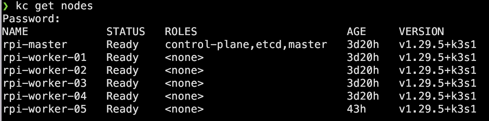

# k3s-rpi

K3S Build and Configuration with Raspberry PIs

# Hardware

I am using the following hardware:

- 2x Raspberry PI Model 4B with 4GB RAM using a PoE hat
- 2x Raspberry PI Model 4B with 8GB RAM using a PoE hat
- 1x Raspberry PI Model 3B+ with 1GB RAM using a PoE hat
- 1x Raspberry PI Model 3B with 1GB RAM using power adapter

On the Raspberry PI 4B models I am using a 64GB SD card connected via a USB 3.0 SD Card reader instead of the built-in SD card slot for increased data transfer speed.

In the Raspberry PI 3B models I am using a 64GB SD card directly.

Network connectivity is provided via a Ubiquity Unifi 16 port PoE switch.

# Kubernetes

After researching several articles I decided on using K3S instead of K3D, K2S, Kind or MiniCube.

Initially, I used the Raspberry PI 3B+ as the control plane but as soon as I had built the cluster and started querying the API with `kubectl` and `K9S` it became apparent that the 3B+ was lagging considerably and not able to cope.

In the final configuration here, the master node is one of the Raspberry PI 4B models with 4GB RAM.

# Initial Setup

The steps below are all executed from Mac OS using Kitty and Terminus.

- Download Raspberry PI Imager from [https://www.raspberrypi.com/software/]
- Download latest 64-bit Raspberry PI OS Lite from [https://downloads.raspberrypi.com/raspios_lite_arm64/images/raspios_lite_arm64-2024-03-15/2024-03-15-raspios-bookworm-arm64-lite.img.xz]
- Install the OS on each SD card using the imager. I created a profile to allow SSH access, set a username and password, and set the localisation.
- I am using DHCP to allocate each device with a fixed IP address in a dedicated development network (`192.168.3.0/27`) created in the Ubiquity Network management interface.

# Raspberry PI Setup

- Connect to each RPi using SSH:

  `ssh username@192.168.3.xxx`

- Update the Raspberry PI:

  `sudo apt-get update`

  `sudo apt-get upgrade`

  `sudo apt-get full-upgrade`

- Turn off the swapfile:

  `sudo swapoff -a`

  `sudo nano /etc/dphys-swapfile`

- Set: `CONF_SWAPSIZE=0`

- Enable cgroup:

  `sudo nano /boot/firmware/cmdline.txt`

- Add: `cgroup_enable=cpuset cgroup_memory=1 cgroup_enable=memory`

- Disable other services:

  `sudo nano /etc/modprobe.d/raspi-blacklist.conf`

- Add:

  `# WiFi`

  `blacklist brcmfmac`

  `blacklist brcmutil`

  `# Bluetooth`

  `blacklist btbcm`

  `blacklist hci_uart`

- Continue disabling services:

  `sudo systemctl disable bluetooth && sudo systemctl stop bluetooth`

  `sudo systemctl disable avahi-daemon && sudo systemctl stop avahi-daemon`

  `sudo systemctl disable triggerhappy && sudo systemctl stop triggerhappy`

- For RPi mounted in Uctronics rack with OLED screens enable I2C interface and installed OLED display software:

  `sudo apt-get install git`

  `git clone https://github.com/UCTRONICS/U6143_ssd1306.git`

  `sudo nano /etc/rc.local`

- Add:

  `cd /home/parrisg/U6143_ssd1306/C`

  `sudo make clean`

  `sudo make`

  `sudo ./display &`

- Reboot:

  `sudo reboot`

# Kubernetes Setup

- On the master node, install K3S:

  `curl -sfL https://get.k3s.io | INSTALL_K3S_EXEC="server --disable=traefik --flannel-backend=host-gw --tls-san=192.168.3.10 --bind-address=192.168.3.10 --advertise-address=192.168.3.10 --node-ip=192.168.3.10 --cluster-init" sh -s -`

- Extract the token:

  `sudo cat /var/lib/rancher/k3s/server/node-token`

- On each of the worker nodes, install K3S with the extracted token:

  `curl -sfL https://get.k3s.io | K3S_URL=https://192.168.3.10:6443 K3S_TOKEN="xxxxxxxxxxxxxxxxxxxxxxxxxxxxxxx" sh -`

- On the master node, install `kubectl`:

  `curl -LO "https://dl.k8s.io/release/$(curl -L -s https://dl.k8s.io/release/stable.txt)/bin/linux/arm64/kubectl"`

- On the master node, copy the `.kube/config` file contents:

  `sudo cat /etc/rancher/k3s/k3s.yaml`

- On Mac OS, install `k3sup` and `k9s` using `brew`:

  `brew install k3sup`

  `brew install k9s`

- On Mac OS, paste the .kube/config file contents to:

  `~/.kube/config`

You can now run `kubectl` or `k9s` from the Mac to query and manage the cluster.

# References

[https://plone.lucidsolutions.co.nz/hardware/raspberry-pi/3/disable-unwanted-raspbian-services]

[https://anthonynsimon.com/blog/kubernetes-cluster-raspberry-pi/#bonus-using-nginx-instead-of-traefik-as-ingress]

[https://alexsniffin.medium.com/a-guide-to-building-a-kubernetes-cluster-with-raspberry-pis-23fa4938d420]

[https://www.linkedin.com/pulse/build-your-own-private-cloud-home-raspberry-pi-minio-huerta-arias/]

# Notes

- To get Raspberry PI memory:

  `grep MemTotal /proc/meminfo`
