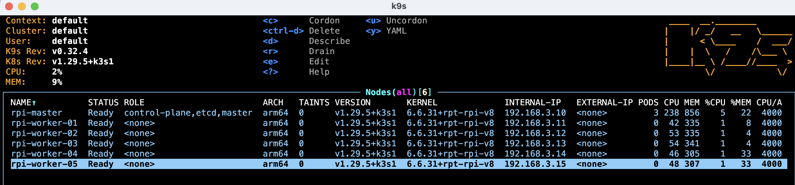

# K3S Installation

K3S Build and Configuration with Raspberry PIs

## Kubernetes

After researching several articles I decided on using:

- [K3S](https://k3s.io/)

Alternatives considered were:

- [K3D](https://k3d.io/v5.6.3/)
- [K2D](https://k2d.io/)
- [Kind](https://github.com/kubernetes-sigs/kind)
- [MiniCube](https://kubernetes.io/docs/tutorials/hello-minikube/)

Initially, I used the Raspberry PI 3B+ as the control plane but as soon as I had built the cluster and started querying the API with `kubectl` and `K9S` it became apparent that the 3B+ was lagging considerably and not able to cope.

In the final configuration here, the master node is one of the Raspberry PI 4B models with 4GB RAM.



## Kubernetes Setup

- On the master node, install K3S:

```
curl -sfL https://get.k3s.io | INSTALL_K3S_EXEC="server --disable=traefik --flannel-backend=host-gw --tls-san=192.168.3.10 --bind-address=192.168.3.10 --advertise-address=192.168.3.10 --node-ip=192.168.3.10 --cluster-init" sh -s -
```

- Extract the token:

```
sudo cat /var/lib/rancher/k3s/server/node-token
```

- On each of the worker nodes, install K3S with the extracted token:

```
curl -sfL https://get.k3s.io | K3S_URL=https://192.168.3.10:6443 K3S_TOKEN="xxxxxxxxxxxxxxxxxxxxxxxxxxxxxxx" sh -
```

- On the master node, install `kubectl`:

```
curl -LO "https://dl.k8s.io/release/$(curl -L -s https://dl.k8s.io/release/stable.txt)/bin/linux/arm64/kubectl"
```

- On the master node, copy the `.kube/config` file contents:

```
sudo cat /etc/rancher/k3s/k3s.yaml
```

- On Mac OS, install `k3sup` and `k9s` using `brew`:

```
brew install k3sup
brew install k9s
```

- On Mac OS, paste the `.kube/config` file from the master node contents to: `~/.kube/config`

You can now run `kubectl` or `k9s` from the Mac to query and manage the cluster.

### kubectl

(`kc` is an alias for `sudo kubectl`)


### k9s


## References

[alexsniffin.medium.com/a-guide-to-building-a-kubernetes-cluster-with-raspberry-pis-23fa4938d420](https://alexsniffin.medium.com/a-guide-to-building-a-kubernetes-cluster-with-raspberry-pis-23fa4938d420)

[www.linkedin.com/pulse/build-your-own-private-cloud-home-raspberry-pi-minio-huerta-arias/](https://www.linkedin.com/pulse/build-your-own-private-cloud-home-raspberry-pi-minio-huerta-arias/)

[anthonynsimon.com/blog/kubernetes-cluster-raspberry-pi/#bonus-using-nginx-instead-of-traefik-as-ingress](https://anthonynsimon.com/blog/kubernetes-cluster-raspberry-pi/#bonus-using-nginx-instead-of-traefik-as-ingress)

## Notes
