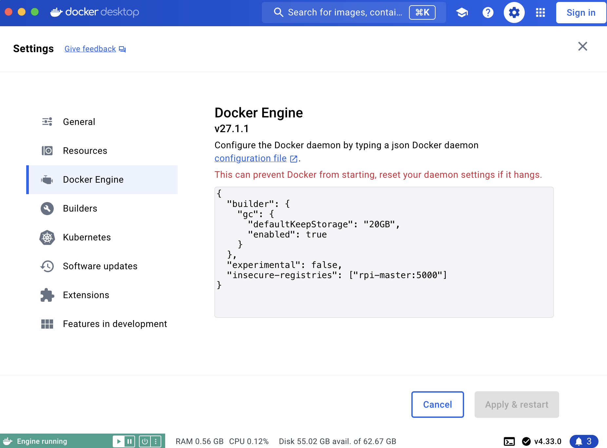

# K3S Private Registry Setup

This document describes how to create a K3S private registry that can be pushed to from a local Docker Desktop.

## Setup Private Registry

- Create a `registry.yaml` file:

```yaml
apiVersion: v1
kind: ReplicationController
metadata:
  name: kube-registry
  namespace: kube-system
spec:
  replicas: 1
  selector:
    app: kube-registry
  template:
    metadata:
      name: kube-registry
      labels:
        app: kube-registry
    spec:
      containers:
        - name: registry
          image: registry:2
          resources:
            limits:
              cpu: 100m
              memory: 200Mi
          env:
            - name: REGISTRY_HTTP_ADDR
              value: :5000
            - name: REGISTRY_STORAGE_FILESYSTEM_ROOTDIRECTORY
              value: /var/lib/registry
            - name: REGISTRY_STORAGE_DELETE_ENABLED
              value: "true"
          volumeMounts:
            - name: registry
              mountPath: /var/lib/registry
          ports:
            - containerPort: 5000
      nodeSelector:
        node-role.kubernetes.io/master: "true"
      volumes:
        - name: registry
          hostPath:
            path: /var/lib/registry
---
apiVersion: v1
kind: Service
metadata:
  name: kube-registry
  namespace: kube-system
spec:
  selector:
    app: kube-registry
  ports:
    - port: 5000
      targetPort: 5000
  type: LoadBalancer
```

- Apply to the cluster:

```bash
kubectl apply -f registry.yaml
```

- Add a `/etc/rancher/k3s/registries.yaml` file on each node in the cluster for K3S to resolve the repository to an IP address using the following template:

```yaml
mirrors:
  "<hostname>:5000":
    endpoint:
      - "http://<ip-address>:5000"
```

- You may need to create a folder on each of the nodes:

```bash
sudo mkdir /etc/rancher/k3s
```

- Create the `registry.yaml` file:

```bash
sudo nano /etc/rancher/k3s/registries.yaml
```

- Copy in the following:

```yaml
mirrors:
  "rpi-master:5000":
    endpoint:
      - "http://192.168.3.10:5000"
```

- Restart the cluster:

```bash
sudo systemctl restart k3s
```

## Configure Desktop Docker

- Add the private registry details to Docker Desktop under `Settings/Docker Engine' in this format:

```json
"insecure-registries": ["<hostname>:5000"]
```

- It should look something like this:

```json
{
  "builder": {
    "gc": {
      "defaultKeepStorage": "20GB",
      "enabled": true
    }
  },
  "experimental": false,
  "insecure-registries": ["rpi-master:5000"]
}
```

- Restart Docker Desktop



## Test Pushing from Docker Desktop to Cluster

- Find a local image to push to the cluster:

```bash
docker images
```

```console
REPOSITORY               TAG       IMAGE ID       CREATED          SIZE
go-api                   v1        81bebf4de0fd   20 minutes ago   16.5MB
```

- Login to the K3S private repository:

```bash
docker login rpi-master:5000
```

- Tag the image:

```bash
docker tag 81bebf4de0fd rpi-master:5000/go-api:v1
```

- Push to the private repository:

```bash
docker push rpi-master:5000/go-api:v1
```

- Create a simple manifest to crete 10 replicas with a service:

```yaml
apiVersion: v1
kind: ReplicationController
metadata:
  name: go-api
  namespace: default
spec:
  replicas: 10
  selector:
    app: go-api
  template:
    metadata:
      name: go-api
      labels:
        app: go-api
    spec:
      containers:
        - name: go-api-container
          image: rpi-master:5000/go-api:v1
          resources:
            limits:
              cpu: 100m
              memory: 200Mi
          ports:
            - containerPort: 9001
---
apiVersion: v1
kind: Service
metadata:
  name: go-api
  namespace: default
spec:
  selector:
    app: go-api
  ports:
    - port: 9001
      targetPort: 80
  type: LoadBalancer
```

Note the container reference explicitly states the K3S private repository `pi-master:5000/go-api:v1`.

- Apply it to the cluster:

```bash
kubectl apply -f go-api.yaml
```

- Check the results:

```bash
kubectl get pods -o wide
```

```console
NAME           READY   STATUS    RESTARTS   AGE     IP           NODE            NOMINATED NODE   READINESS GATES
go-api-4prcb   1/1     Running   0          5m10s   10.42.2.15   rpi-worker-02   <none>           <none>
go-api-96dvr   1/1     Running   0          5m10s   10.42.2.16   rpi-worker-02   <none>           <none>
go-api-df745   1/1     Running   0          5m10s   10.42.1.11   rpi-worker-01   <none>           <none>
go-api-jblvk   1/1     Running   0          5m10s   10.42.1.10   rpi-worker-01   <none>           <none>
go-api-jkxvg   1/1     Running   0          5m10s   10.42.3.14   rpi-worker-03   <none>           <none>
go-api-k696j   1/1     Running   0          5m10s   10.42.0.55   rpi-master      <none>           <none>
go-api-lfpdl   1/1     Running   0          5m10s   10.42.4.11   rpi-worker-04   <none>           <none>
go-api-llnpr   1/1     Running   0          5m10s   10.42.0.54   rpi-master      <none>           <none>
go-api-ngkvn   1/1     Running   0          5m10s   10.42.3.13   rpi-worker-03   <none>           <none>
go-api-nxjrq   1/1     Running   0          5m10s   10.42.4.12   rpi-worker-04   <none>           <none>
```

- Remove it from the cluster:

```bash
kubectl delete -f go-api.yaml
```

## References

[Adding a Private Docker Registry to your RPi Kubernetes Cluster](https://medium.com/@chris.allmark/adding-a-private-docker-registry-to-your-rpi-kubernetes-cluster-3b549cc33c4f)
[How to Use Your Own Registry with Docker Desktop](https://www.docker.com/blog/how-to-use-your-own-registry-2/)

## Notes

## Navigation

- [Next](./?)
- [Index](./README.md)
