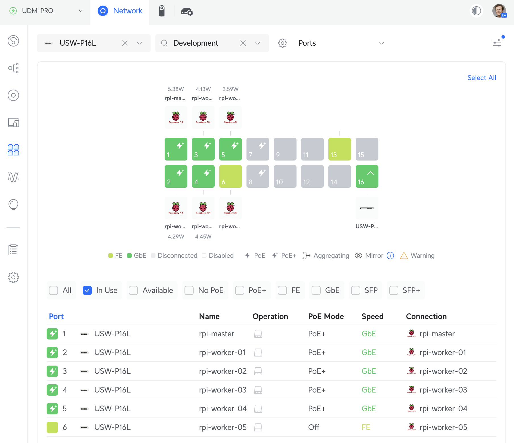

# Raspberry Pi Hardware Build

K3S Build and Configuration with Raspberry PIs

## Hardware

I am using the following hardware:

- 2x Raspberry PI Model 4B with 4GB RAM using a PoE hat
- 2x Raspberry PI Model 4B with 8GB RAM using a PoE hat
- 1x Raspberry PI Model 3B+ with 1GB RAM using a PoE hat
- 1x Raspberry PI Model 3B with 1GB RAM using power adapter

On the Raspberry PI 4B models I am using a 64GB SD card connected via a USB 3.0 SD Card reader instead of the built-in SD card slot for increased data transfer speed.


In all Raspberry PI models I am using a 64GB SD card, either via an external USB3 card reader, or in the PIs SD card slot.

Network connectivity is provided via a Ubiquity Unifi 16 port PoE switch.



## Initial Setup

The steps below are all executed from Mac OS using Kitty and Terminus.

- Download [Raspberry PI Imager](https://www.raspberrypi.com/software/)
- Download latest [64-bit Raspberry PI OS Lite](https://downloads.raspberrypi.com/raspios_lite_arm64/images/raspios_lite_arm64-2024-03-15/2024-03-15-raspios-bookworm-arm64-lite.img.xz)
- Install the OS on each SD card using the imager. I created a profile to allow SSH access, set a username and password, and set the localisation.
- I am using DHCP to allocate each device with a fixed IP address in a dedicated development network (`192.168.3.0/27`) created in the Ubiquity Network management interface.
  

## Raspberry PI Setup

- Connect to each RPi using SSH:

```bash
ssh username@192.168.3.xxx
```

- Update the Raspberry PI:

```bash
sudo apt update && sudo apt upgrade -y
```

- Turn off the swapfile:

```bash
sudo swapoff -a
```

```bash
sudo nano /etc/dphys-swapfile
```

- Set: `CONF_SWAPSIZE=0`

- Enable cgroup:

```bash
sudo nano /boot/firmware/cmdline.txt
```

- Add the following to the end of line 1:

```bash
 cgroup_enable=cpuset cgroup_memory=1 cgroup_enable=memory
```

- Disable other services:

```bash
sudo nano /etc/modprobe.d/raspi-blacklist.conf
```

- Add the following:

```bash
# WiFi
blacklist brcmfmac
blacklist brcmutil
# Bluetooth
blacklist btbcm
blacklist hci_uart

```

- Disable other uneccessary services:

```bash
sudo systemctl disable bluetooth && sudo systemctl stop bluetooth
```

```bash
sudo systemctl disable avahi-daemon && sudo systemctl stop avahi-daemon
```

```bash
sudo systemctl disable triggerhappy && sudo systemctl stop triggerhappy
```

- If using the UCTronics Rack with their OLED screens you need to enable I2C interface and install the OLED display software.


- Enable the I2C interface using `raspi-config`:

```bash
sudo raspi-config
```

- Install GIT and pull down the repository:

```bash
sudo apt install git -y
```

```bash
git clone https://github.com/UCTRONICS/U6143_ssd1306.git
```

```bash
sudo nano /etc/rc.local
```

- Add the following before the line containing `exit 0`:

```bash
cd /home/parrisg/U6143_ssd1306/C
sudo make clean
sudo make
sudo ./display &
```

- Change temperature setting to CELSIUS by editing line 12 in the following file:

```bash
sudo nano /home/parrisg/U6143_ssd1306/C/ssd1306_i2c.h
```

- Reboot:

```bash
sudo reboot
```

## References

[plone.lucidsolutions.co.nz/hardware/raspberry-pi/3/disable-unwanted-raspbian-services](https://plone.lucidsolutions.co.nz/hardware/raspberry-pi/3/disable-unwanted-raspbian-services)

[https://github.com/UCTRONICS/U6143_ssd1306](https://github.com/UCTRONICS/U6143_ssd1306)

## More Images


## Notes

- To get Raspberry PI memory:

```bash
grep MemTotal /proc/meminfo`
```

## Navigation

- [Next](./ssd-raid-nfs.md)
- [Index](./README.md)
