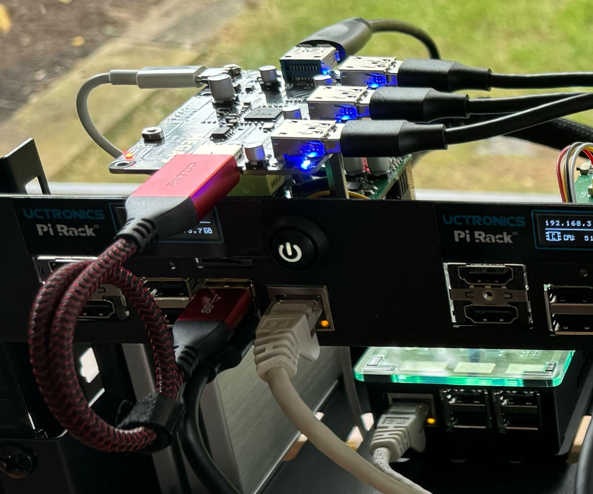

# SSD, RAID 10 and NFS Setup

This document describes how to connect four USB SSDs to a Raspberry Pi using a powered USB3 hub and how to create a RAID 10 array that can be accessed via NFS.

## Hardware

I am using a UUGear MEGA4: 4-Port USB 3.1 PPPS Hub designed for Raspberry Pi 4B. It adds 4 more USB 3.1 ports to a Raspberry Pi 4B, and the power on each port can be turned ON or OFF separately via software.

The MEGA4 is also a powered hub and you can connect a 5V power supply to its USB type C connector and significantly increase its current output ability.


### No Back-Power

Back-power (or back feeding power) here means the USB hub provides electronic power to Raspberry Pi. The Raspberry PI 4B does not like back feeding power, and the MEGA4 does not support back-power unlike many other USB3 hubs.

On the MEGA4 board, there is an "ideal diode" implemented with MOSFET (AO4447). This "ideal diode" connects the Vbus on Raspberry Pi 4B's USB 3.1 port and the 5V trace on MEGA4. Hence MEGA4 can draw current from Raspberry Pi 4B and get powered.

The MEGA4 has a USB type C connector, which allows you to connect a supplemental 5V power supply to increase MEGA4's current output ability. Because of the existence of the "ideal diode", the power provided via USB type C connector will not be fed to
Raspberry Pi 4B.

## MEGA4 Setup

- Install the MEGA4 and connect it to your Raspberry Pi:



- Boot into the Raspberry Pi and install the MEGA4 software:

```bash
wget https://www.uugear.com/repo/MEGA4/install.sh
```

```bash
sudo sh install.sh
```

- To control the MEGA4 board ports you can use the following command:

```bash
sudo ./mega4/mega4.sh
```

## SSD Setup

- Connect your SSDs to the powered USB hub:


- Ensure all the connected USB drives are wiped with no partitions. Execute `fdisk` for each drive e.g. `sda`, `sdb`, `sdc`, `sdd`

```bash
sudo fdisk /dev/sda
```

- Enter:

1. `d` - delete all partitions
2. `n` - create new partitions
3. `p` - primary partition
4. `1` - partition 1
5. `2048` - first sector
6. `+238G` - size in GB (change the size as applicable to your drive sizes)
7. `w` - write chnanges

I have 2 x 500GB and 2 x 240GB SSDs. I selected 238GB as that is the size of the smallest drive (minus a few MB). The RAID 10 partitions will need to be the same size.

The two larger 500GB drives will only use 238GB and therefore have some space free for other partitions if needed later.

- Check the drive partition status after initialising:

```bash
lsblk
```

```console
NAME   MAJ:MIN RM   SIZE RO TYPE MOUNTPOINTS
sda      8:0    0 476.9G  0 disk
└─sda1   8:1    0   238G  0 part
sdb      8:16   0 465.8G  0 disk
└─sdb1   8:17   0   238G  0 part
sdc      8:32   0 238.5G  0 disk
└─sdc1   8:33   0   238G  0 part
sdd      8:48   0 238.5G  0 disk
└─sdd1   8:49   0   238G  0 part
```

## RAID 10 Setup

- Install RAID package:

```bash
sudo apt install mdadm -y
```

- Create RAID 10 array using all 4 drives:

```bash
sudo mdadm --create --verbose /dev/md0 --level=10 --raid-devices=4 /dev/sd[a-d]1
```

```console
mdadm: layout defaults to n2
mdadm: layout defaults to n2
mdadm: chunk size defaults to 512K
mdadm: size set to 249428992K
mdadm: automatically enabling write-intent bitmap on large array
mdadm: Defaulting to version 1.2 metadata
mdadm: array /dev/md0 started.
```

md0 below can change to another number e.g. md127

- Wait for the array to build/resync. This can take some time depending on the size of your disks. It will be indicated when the output of following command reaches 100%:

```bash
cat /proc/mdstat
```

```console
Personalities : [raid10]
md0 : active raid10 sdd1[3] sdc1[2] sdb1[1] sda1[0]
      498857984 blocks super 1.2 512K chunks 2 near-copies [4/4] [UUUU]
      [===================>.]  resync = 99.4% (495911552/498857984) finish=0.3min speed=139110K/sec
      bitmap: 1/4 pages [4KB], 65536KB chunk

unused devices: <none>
```

- You can also check the status with this command:

```bash
sudo mdadm --detail /dev/md0
```

```console
           Version : 1.2
     Creation Time : Sat Aug  3 14:48:00 2024
        Raid Level : raid10
        Array Size : 498857984 (475.75 GiB 510.83 GB)
     Used Dev Size : 249428992 (237.87 GiB 255.42 GB)
      Raid Devices : 4
     Total Devices : 4
       Persistence : Superblock is persistent

     Intent Bitmap : Internal

       Update Time : Sat Aug  3 15:46:38 2024
             State : clean
    Active Devices : 4
   Working Devices : 4
    Failed Devices : 0
     Spare Devices : 0

            Layout : near=2
        Chunk Size : 512K

Consistency Policy : bitmap

              Name : rpi-master:0  (local to host rpi-master)
              UUID : 897ac68e:b33c234b:0581f685:2b6c0b91
            Events : 701

    Number   Major   Minor   RaidDevice State
       0       8        1        0      active sync set-A   /dev/sda1
       1       8       17        1      active sync set-B   /dev/sdb1
       2       8       33        2      active sync set-A   /dev/sdc1
       3       8       49        3      active sync set-B   /dev/sdd1
```

- When the array is ready, create a folder to access the array with:

```bash
sudo mkdir /mnt/nfs
```

- Format the array with `ext4` format:

```bash
sudo mkfs.ext4 /dev/md0
```

- Reboot:

```bash
sudo reboot
```

- Check status after reboot:

```bash
lsblk
```

```console
NAME      MAJ:MIN RM   SIZE RO TYPE   MOUNTPOINTS
sda         8:0    1     0B  0 disk
sdb         8:16   1     0B  0 disk
sdc         8:32   1     0B  0 disk
sdd         8:48   1     0B  0 disk
sde         8:64   1  58.9G  0 disk
├─sde1      8:65   1   512M  0 part   /boot/firmware
└─sde2      8:66   1  58.4G  0 part   /
sdf         8:80   0 476.9G  0 disk
└─sdf1      8:81   0   238G  0 part
  └─md127   9:127  0 475.7G  0 raid10
sdg         8:96   0 465.8G  0 disk
└─sdg1      8:97   0   238G  0 part
  └─md127   9:127  0 475.7G  0 raid10
sdh         8:112  0 238.5G  0 disk
└─sdh1      8:113  0   238G  0 part
  └─md127   9:127  0 475.7G  0 raid10
sdi         8:128  0 238.5G  0 disk
└─sdi1      8:129  0   238G  0 part
  └─md127   9:127  0 475.7G  0 raid10
```

Note how the RAID identifier has changed from `md0` to `md127`.

- Mount the drive:

```bash
sudo mount /dev/md127 /mnt/nfs
```

- Configure and persist the array on boot:

```bash
sudo mdadm --detail --scan | sudo tee -a /etc/mdadm/mdadm.conf
```

- Get the partition id:

```bash
blkid
```

```console
/dev/md127: UUID="0a519d22-8c0e-4903-92c0-2de082485898" BLOCK_SIZE="4096" TYPE="ext4"
```

- Add this UUID to `/etc/fstab`:

```bash
sudo nano /etc/fstab
```

Add `UUID=0a519d22-8c0e-4903-92c0-2de082485898 /mnt/nfs ext4 defaults,noatime,nofail 0 2`

The `nofail` option tells the system to ignore any errors on mounting and to continue booting even if the device cannot be mounted properly.

The `noatime` options gives a small performance increase. It tells the kernel not to track the Last Accessed time, avoiding that tiny performance hit to continually update `atime` in the filesystem.

- Reboot:

```bash
sudo reboot
```

## NFS Server Setup

- Install NFS server:

```bash
sudo apt install nfs-kernel-server -y
```

- Create a test file in the NFS folder:

```bash
sudo mkdir -p /mnt/nfs/everyone
```

```bash
sudo chown -R parrisg /mnt/nfs/everyone
```

```bash
echo "Hello World" | sudo tee /mnt/nfs/everyone/hi_there.txt
```

- Setup the NFS exports file:

```bash
sudo nano /etc/exports
```

Add the following `/mnt/nfs/everyone *(rw,sync,no_subtree_check)` to allow everyone read and write access.

- Reload the NFS exports:

```bash
sudo exportfs -ar
```

- Test from anothter Raspberry Pi:

```bash
sudo mount -t nfs 192.168.3.10:/mnt/nfs/everyone /mnt
```

```bash
cat /mnt/hi_there.txt
```

```console
Hello World
```

- Test writes:

```bash
echo "test" > /mnt/test.txt
```

- Reboot, and retest connectivity and access:

```bash
sudo reboot
```

## References

[https://www.uugear.com/product/mega4-4-port-usb-3-ppps-hub-for-raspberry-pi-4b/](https://www.uugear.com/product/mega4-4-port-usb-3-ppps-hub-for-raspberry-pi-4b/)
[MEGA4 User Manual](https://www.uugear.com/doc/MEGA4_UserManual.pdf)
[https://www.youtube.com/watch?v=EzqgJhu-qN8](https://www.youtube.com/watch?v=EzqgJhu-qN8)

## Notes

## Navigation

- [Next](./k3s-install.md)
- [Index](./README.md)
